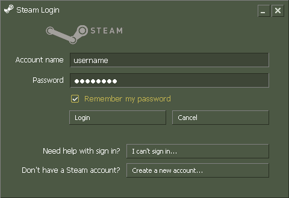
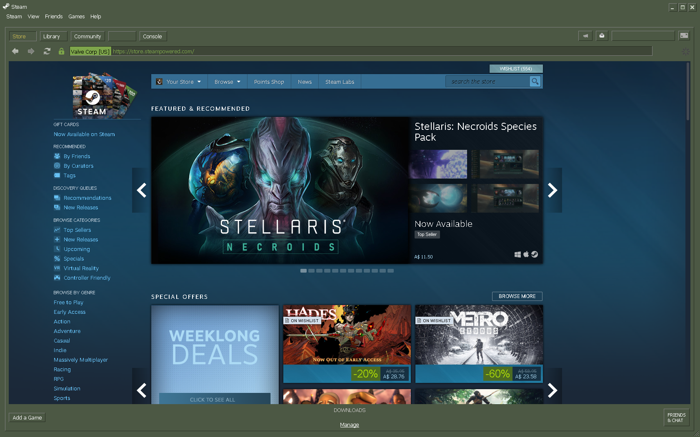
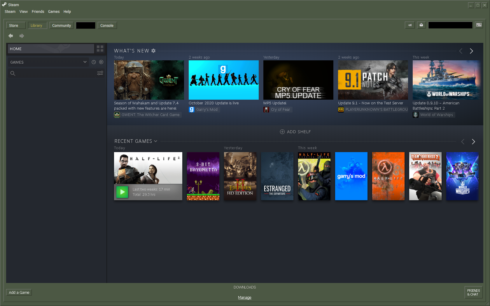
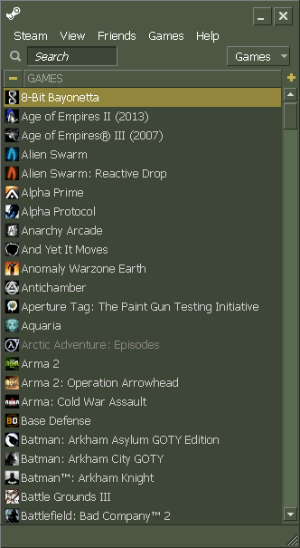
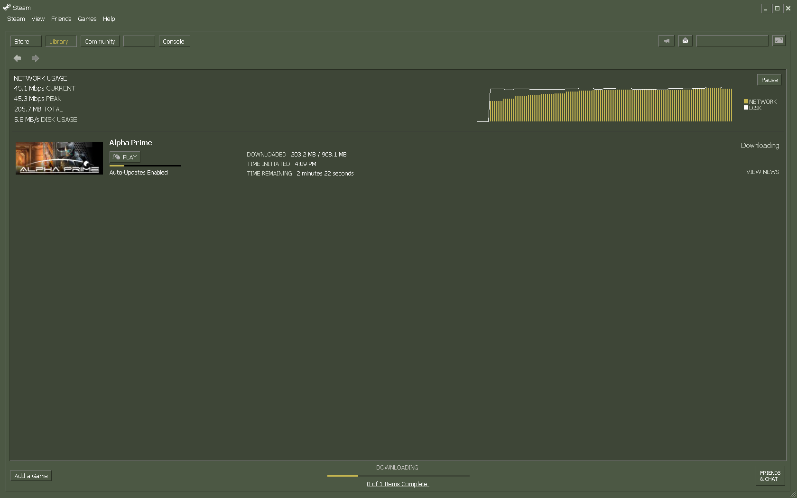
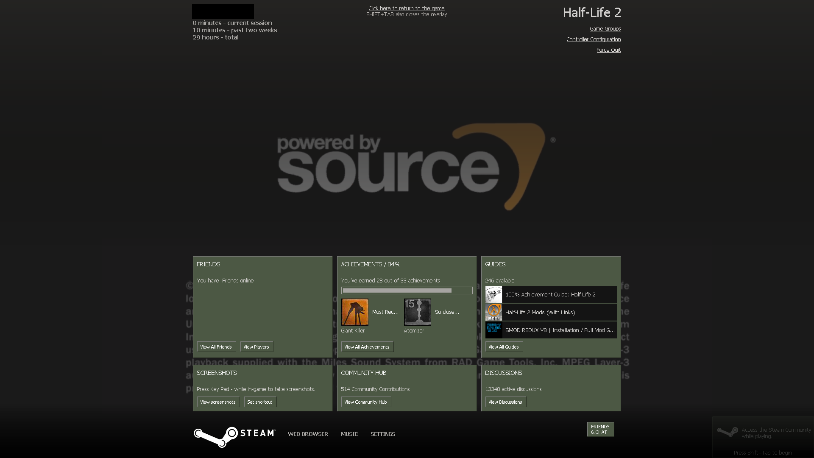
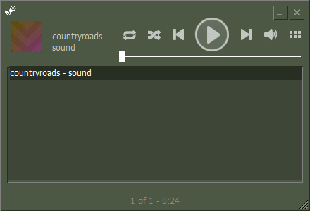

# OG-Steam

Update: Try OG-Steam-Library theme for use with <a href="https://github.com/PhantomGamers/SteamFriendsPatcher">SteamFriendsPatcher<a>.

An Internet Time Warp
-

This skin is intended to replicate the style of Steam from around 2004. From a skinning perspective, I think this is as far back as anyone can reasonably take the Steam client. Several tweaks have been made using visual references and original Steam assets.

This version includes fixes for the latest version of the Steam client (**Last Updated 2020-10-28**).

Installing
-

**Note: This skin has not been tested on Linux or MacOS**

* Copy **OG-Steam** into `Steam/skins`
* Select the new skin trough `Settings/Interface`
* Disable font smoothing in both Steam and Windows for a retro look.

Known Issues
-

* Window minimise/maximise/close buttons do not render properly on some windows. This is because some containers do not have associated .res files so there is no way to specify button positions (that I am aware of).
* Overlay web browser seems to have some hard-coded styling that I have been unable to change.

Preview
-

